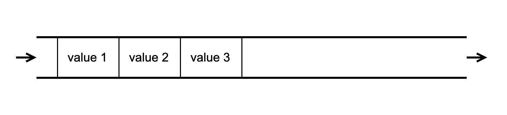

### Queue

  
Общая информация

 

Queue (очередь) - это контейнер с элементами, организованными по принцнипу FIFO (First-In, First-Out). Так же как список, объект контейнерного класса очереди содержит в себе указатели на "хвост" и "голову" очереди, однако удаление производится строго из "головы", а запись, то есть добавление новых элементов, строго в "хвост". Очередь удобно представлять как своего рода трубу, в один конец которой попадают элементы, и убывают с другого конца.

  
Спецификация

 

*Queue Member type*

В этой таблице перечислены внутриклассовые переопределения типов (типичные для стандартной библиотеки STL), принятые для удобства восприятия кода класса:

| Member type      | Definition                                       |
|------------------|--------------------------------------------------|
| `value_type`       | `T` the template parameter T                   |
| `reference`              | `T &` defines the type of the reference to an element                                                             |
| `const_reference`        | `const T &` defines the type of the constant reference                                         |
| `size_type`        | `size_t` defines the type of the container size (standard type is size_t) |

*Queue Member functions*

В этой таблице перечислены основные публичные методы для взаимодействия с классом:

| Functions      | Definition                                      |
|----------------|-------------------------------------------------|
| `queue()`  | default constructor, creates empty queue                                 |
| `queue(std::initializer_list<value_type> const &items)`  | initializer list constructor, creates queue initizialized using std::initializer_list<T>    |
| `queue(const queue &q)`  | copy constructor  |
| `queue(queue &&q)`  | move constructor  |
| `~queue()`  | destructor  |
| `operator=(queue &&q)`      | assignment operator overload for moving object                                |

*Queue Element access*

В этой таблице перечислены публичные методы для доступа к элементам класса:

| Element access | Definition                                      |
|----------------|-------------------------------------------------|
| `const_reference front()`          | access the first element                        |
| `const_reference back()`           | access the last element                         |

*Queue Capacity*

В этой таблице перечислены публичные методы для доступа к информации о наполнении контейнера:

| Capacity       | Definition                                      |
|----------------|-------------------------------------------------|
| `bool empty()`          | checks whether the container is empty           |
| `size_type size()`           | returns the number of elements                  |

*Queue Modifiers*

В этой таблице перечислены публичные методы для изменения контейнера:

| Modifiers        | Definition                                       |
|------------------|--------------------------------------------------|
| `void push(const_reference value)`             | inserts element at the end                       |
| `void pop()`              | removes the first element                        |
| `void swap(queue& other)`             | swaps the contents                               |

  
Для тестирования

 
  Зайти в репозиторий

  Ввести в командную строку ''make''  
  Чтобы посмотреть покрытие через браузер, надо открыть файл queue_coverage_report.html после использования ''make''

  
Для использования

 
  Достаточно добавить #include "s21_queue.h" в заголовок проекта, в котором собираетесь его использовать

